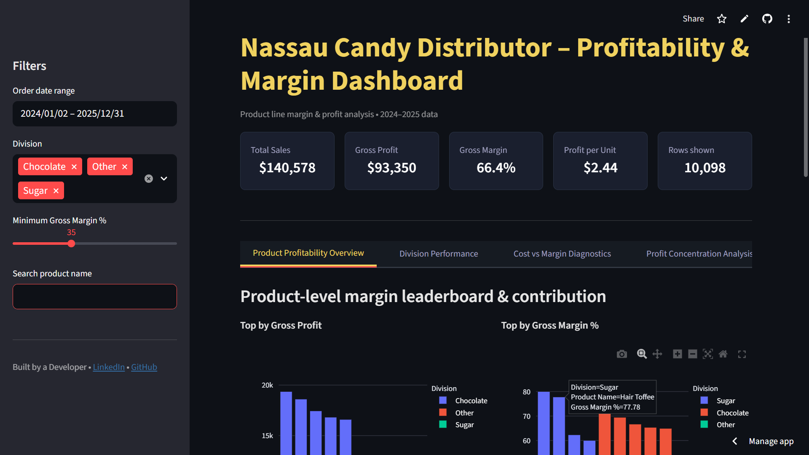
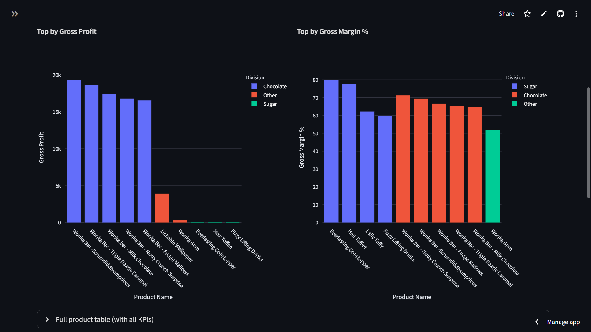
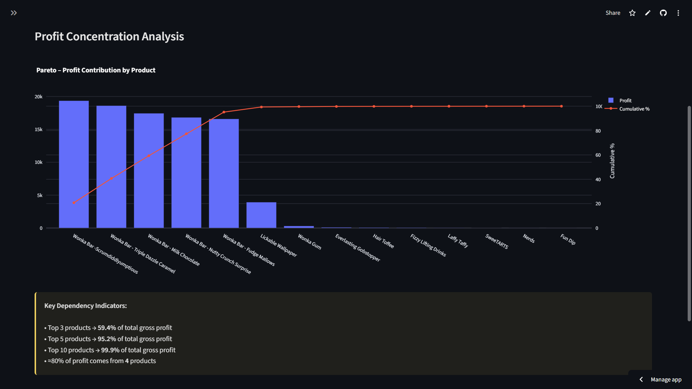

# Profitability Intelligence & Margin Risk Modeling Dashboard

[Live Application](https://nikhil-profitability-dashboard.streamlit.app/)  
[Research Publication (DOI)](https://doi.org/10.5281/zenodo.18729616)


---

## Overview

This project presents a structured profitability intelligence system designed to evaluate product-level and division-level financial performance within a distribution-based enterprise.

Rather than focusing solely on revenue growth, the system emphasizes:

- Margin efficiency  
- Profit concentration risk  
- Cost-to-sales imbalance  
- Division-level profitability gaps  
- Temporal margin stability  

The framework integrates financial metric engineering, Pareto modeling, volatility diagnostics, and interactive visualization to support margin-driven strategic decision-making.

---

## Business Context

Revenue growth does not guarantee sustainable profitability.

Distribution environments often face:

- High-volume, low-margin products  
- Structural dependency on a limited number of profit-driving SKUs  
- Cost-heavy products reducing efficiency  
- Revenue-profit mismatch across divisions  
- Margin instability over time  

This project provides structured analytical visibility into these risks.

---

## Live Dashboard

Access the deployed application:

https://nikhil-profitability-dashboard.streamlit.app/

The dashboard enables dynamic filtering, real-time KPI recalculation, and interactive exploration of financial performance.

---

## Research Publication

This project is formally documented as an academic research paper and published on Zenodo with a permanent DOI:

https://doi.org/10.5281/zenodo.18729616

The publication details:

- Financial metric engineering methodology  
- Profit concentration modeling  
- Margin volatility measurement  
- Cost diagnostics framework  
- Strategic optimization recommendations  

---

## Dashboard Preview





---

## Key Features

### Interactive Filtering
- Date range selection  
- Division multi-select  
- Minimum gross margin threshold  
- Product name search  
- Dynamic real-time metric recalculation  

### KPI Monitoring
- Total Sales  
- Gross Profit  
- Gross Margin (%)  
- Profit per Unit  
- Record Count  

### Product-Level Intelligence
- Top products by gross profit  
- Margin efficiency ranking  
- Revenue vs profit comparison  
- Contribution analysis  

### Profit Concentration Modeling
- Pareto-based cumulative profit curve  
- 80% contribution threshold detection  
- Dependency risk visibility  

### Margin Volatility Analysis
- Monthly average margin trend  
- Stability diagnostics  
- Operational risk signaling  

### Data Export
- Download filtered dataset as CSV  

---

## Analytical Insights

- A small subset of products generates the majority of total profit  
- Several high-revenue products operate at inefficient margins  
- Profit generation is structurally concentrated  
- Division-level financial imbalance exists  
- Margin volatility indicates operational instability  

---

## Strategic Recommendations

- Reprice high-volume, low-margin SKUs  
- Optimize supplier contracts for cost-heavy products  
- Diversify profit-generating product lines  
- Implement margin threshold monitoring  
- Track volatility as an early-warning indicator  

---

## Technology Stack

- Python  
- Pandas  
- Plotly  
- Streamlit  
- Financial Metric Engineering  
- Exploratory Data Analysis  

---

## Project Structure

```
project-root/
│
├── app/
│   └── app.py
│
├── assets/
│   ├── dashboard-overview.png
│   ├── product-profitability.png
│   └── pareto-analysis.png
│
├── data/
│   └── Nassau Candy Distributor.csv
│
├── notebooks/
│   ├── 01_data_overview.ipynb
│   ├── 02_data_cleaning.ipynb
│   ├── 03_profitability_metrics.ipynb
│   ├── 04_visual_analysis.ipynb
│   └── 05_insights_recommendations.ipynb
│
├── report/
│   ├── Profitability_Intelligence_Journal_Paper.pdf
│   └── Project_Report_Summary.md
│
├── requirements.txt
└── README.md
```

---

## Run Locally

Install dependencies:

```
pip install -r requirements.txt
```

Run the application:

```
streamlit run app/app.py
```

Open in browser:

```
http://localhost:8501
```

---

## Citation

If referencing this work in academic or professional contexts:

Nikhil Singh (2025). *Profitability Intelligence and Margin Risk Modeling for Product Portfolio Optimization in Distribution-Based Enterprises*. Zenodo. https://doi.org/10.5281/zenodo.18729616

---

## Conclusion

This project demonstrates how profitability-focused analytics provides deeper strategic insight than revenue analysis alone.

By combining metric engineering, Pareto modeling, volatility analysis, and interactive visualization, the system establishes a scalable framework for margin-aware portfolio optimization.

It bridges business intelligence with analytical rigor and research-backed methodology.

---

## Author

Nikhil Kumar Singh  
BCA (Artificial Intelligence & Machine Learning)  
AI & Data Analytics Enthusiast  

GitHub: https://github.com/nikhilsingh-k  
LinkedIn: https://www.linkedin.com/in/nikhilsingh-k/
